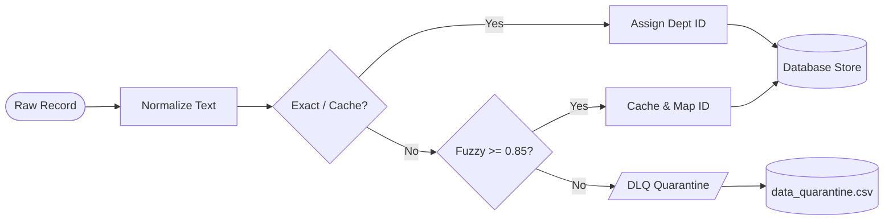
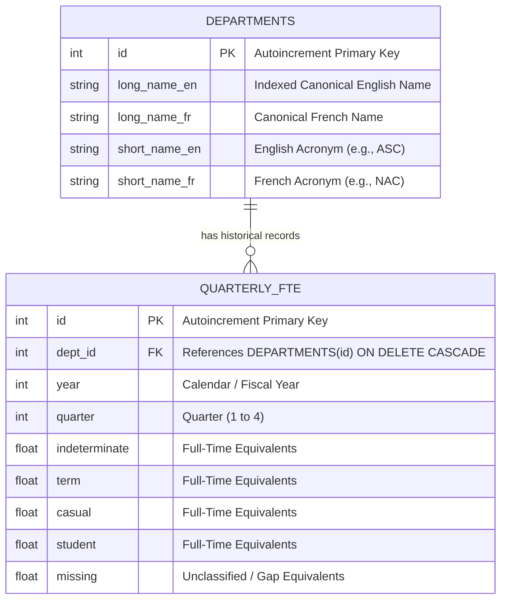
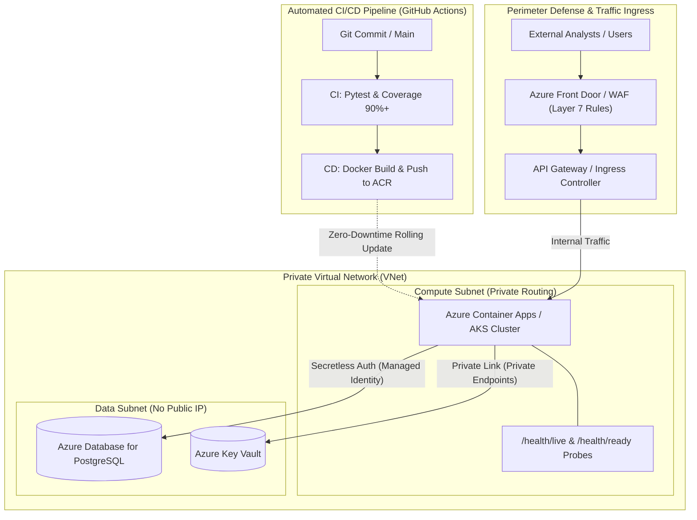

# System Architecture & Technical Design Document

This document provides a comprehensive technical overview of the **PBO Workforce Data Service**, covering the real-world ETL reconciliation challenges, database modeling, pragmatic technical trade-offs, and an enterprise cloud roadmap for downstream PBO analysts.

---

## 1. High-Level Architecture Overview

The service transitions raw, inconsistent departmental spreadsheets into clean, standardized, and high-performance analytical REST interfaces:

```text
[ Raw Excel Datasets ] (data/data.xlsx)
│
▼
[ ETL Ingestion & Reconciliation Engine ] ──► [ Dead-Letter Queue (DLQ) Audit ]
  Tiered String Matching + Memoization Cache    (data_quarantine.csv)
  Statutory Tenure Normalization
│
▼
[ Relational Storage Layer ]
  Local Prototype: SQLite (Zero External Dependencies)
  Production Ready: PostgreSQL (SQLAlchemy ORM Decoupled)
  Compound Indexing: (dept_id, year, quarter)
│
▼
[ FastAPI High-Performance Application Layer ]
  Liveness & Readiness Cluster Probes (/health/live, /health/ready)
  Parameter Whitelisting & Dynamic Field Projection
│
▼
[ PBO Analytical Consumers: R / Python / PowerBI / Excel Modeling Workflows ]
```

---

## 2. Ingestion & Entity Resolution: Real-World Data Challenges

External records seldom arrive clean. The data ingestion process (`import_data.py` and `app/pipeline.py`) addresses data inconsistencies across federal reporting bodies without relying on rigid, hardcoded dictionary aliases.

### 2.1 Tackling Real Dirty Data in `data.xlsx`
During source data exploration, our pipeline encountered and resolved several tangible data traps:
* **Invisible Whitespace & Escaped Characters**: Department strings frequently contained trailing tabs, multiple contiguous spaces, and embedded line breaks (e.g., `"Department of Finance \n"` vs `"Department of Finance"`). Our pipeline applies text normalization (`DataCleaningPipeline.normalize_text`) before any matching.
* **Bilingual Inconsistencies & Acronym Drifts**: Entities reported alternatively by their English name, French name, or operational acronyms (e.g., `"ASC"` vs `"Accessibility Standards Canada"` vs `"Normes d'accessibilité Canada"`). The pipeline dynamically builds a multi-key index from canonical metadata sheets.
* **Typographical Variants**: Near-miss spelling differences are caught using Levenshtein distance heuristics (`difflib.get_close_matches` with an $0.85$ confidence cutoff), preventing dropped records without manual intervention.

### 2.2 Ingestion Engine Workflow



### 2.3 Business Assumption: Handling "Combined" Tenure
* **The Context**: In federal workforce reporting, security and defense entities (e.g., RCMP, DND) occasionally report personnel counts under a blanket "Combined" category rather than granular breakdowns.
* **Our Pragmatic Assumption**: In this prototype, "Combined" is mapped to "indeterminate" under the operational rationale that core regular-force members represent permanent, continuing positions.
* **Flexibility Notice**: We openly acknowledge this is an analytical assumption driven by limited domain context. The transformation logic in `DataCleaningPipeline.normalize_tenure` is purposely decoupled. Should departmental stakeholders specify an alternative apportionment rule (e.g., allocating a fixed percentage to term or reporting as a dedicated statutory slice), this mapping can be altered with a single configuration adjustment without altering the underlying database schema.

---

## 3. Database Schema & Query Optimization

The relational data model is designed to support rapid multi-year time-series aggregations while preserving bilingual metadata.

### 3.1 Entity Relationship Diagram (ERD)



### 3.2 Performance & Compound Indexing Strategy
* **Compound Index (`idx_dept_year_quarter`)**: Analytical queries overwhelmingly filter on a specific organization across a range of fiscal years (`WHERE dept_id = :id AND year = :year`). A multi-column B-Tree index on `(dept_id, year, quarter)` in `app/models.py` enables index-only lookups, avoiding costly full table scans.

---

## 4. Assessment Context: Architectural Trade-Offs

Given the scope of this take-home exercise, architectural choices were selected to maximize evaluator portability while maintaining enterprise upgrade paths:

| Architectural Area | Prototype Choice | Enterprise Production Target | Engineering Rationale & Upgrade Path |
| :--- | :--- | :--- | :--- |
| **Storage Engine** | SQLite (via SQLAlchemy) | Managed PostgreSQL (Azure Flexible Server) | **Why for Assessment**: Zero-dependency local evaluation. The evaluator needs no local database server or external credentials.<br><br>**Production Path**: Because models are decoupled via SQLAlchemy ORM, switching to PostgreSQL requires updating only the `DATABASE_URL` environment variable. |
| **Concurrency Model** | Synchronous ORM + FastAPI Worker Pool | Asynchronous ORM (`asyncpg` / `greenlet`) | **Why for Assessment**: Predictable execution, clean testing fixtures, and sub-15ms response times on typical analytical queries.<br><br>**Production Path**: Wrap sessions in `AsyncSession` for extreme high-throughput requirements. |
| **Data Ingestion** | In-Process Pandas Pipeline | Distributed Celery / Azure Functions Event Grid | **Why for Assessment**: Synchronous, inspectable feedback during `import_data.py`.<br><br>**Production Path**: Decouple ingestion into event-driven serverless workers when handling multi-gigabyte continuous feeds. |

---

## 5. Supporting PBO Analysts & Downstream Workflows

The system architecture addresses the practical needs of adapting data delivery to analytical staff and policy researchers:

* **Frictionless Consumption Across Toolchains**:
  * PBO analysts rely on diverse workflows ranging from statistical environments (R, Python) to spreadsheet modeling (Excel, Power BI).
  * The API produces standardized, flat JSON structures designed for direct ingestion into analytical DataFrames, eliminating tedious manual reshaping.
* **Targeted Querying (Reducing Client Overhead)**:
  * Using optional parameters such as `?year=2021` and `?tenure=casual`, analysts can pull exact data slices directly into their costing models without needing to fetch and filter entire multi-year departmental series locally.
* **Preserving Analytical Integrity & Transparency**:
  * Public sector costing models require strict accountability. Instead of silently dropping malformed records or coercing unknown figures, the pipeline exposes unclassified FTEs via the explicit `missing` category and logs low-confidence matches to `data_quarantine.csv`. This ensures analysts have full visibility into data quality boundaries when preparing parliamentary estimates.
* **Future Workflow Recommendations (Advisory)**:
  * **Direct Tabular Export**: For analysts working predominantly in Excel, extending the API to support `Accept: text/csv` would allow one-click Power Query refresh without JSON parsing.
  * **Scheduled Snapshot Feeds**: Generating pre-aggregated fiscal-year summary tables can accelerate recurring quarterly reports during intense parliamentary budget cycles.

---

## 6. Enterprise Cloud Evolution: Protected B & Scalability Blueprint

To demonstrate production readiness within the Government of Canada digital environment, the diagram below outlines how this prototype scales to a fully automated, Protected B cloud deployment:



### Key Enterprise Features:
* **Zero-Downtime Continuous Deployment (CD)**: Builds container images, tags with Git SHA, pushes to private container registries (ACR), and executes blue/green rolling deployments.
* **Auto-Scaling with KEDA**: Dynamically scales compute pods from 1 to 20 instances in response to peak budget cycle inquiry loads, scaling to zero off-hours to optimize cloud spend (FinOps).
* **High Availability & Geographic Redundancy**: Multi-zone replication across Azure Canada Central and Canada East ensures continuity during parliamentary debate cycles.