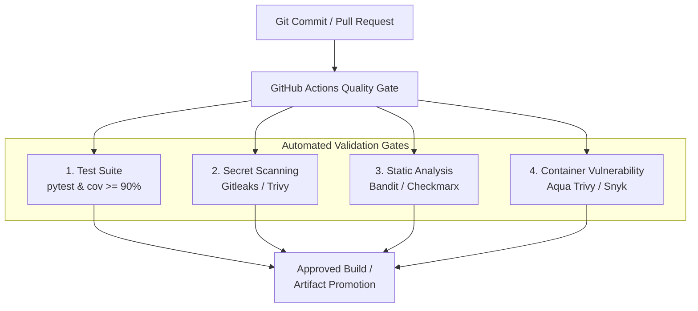
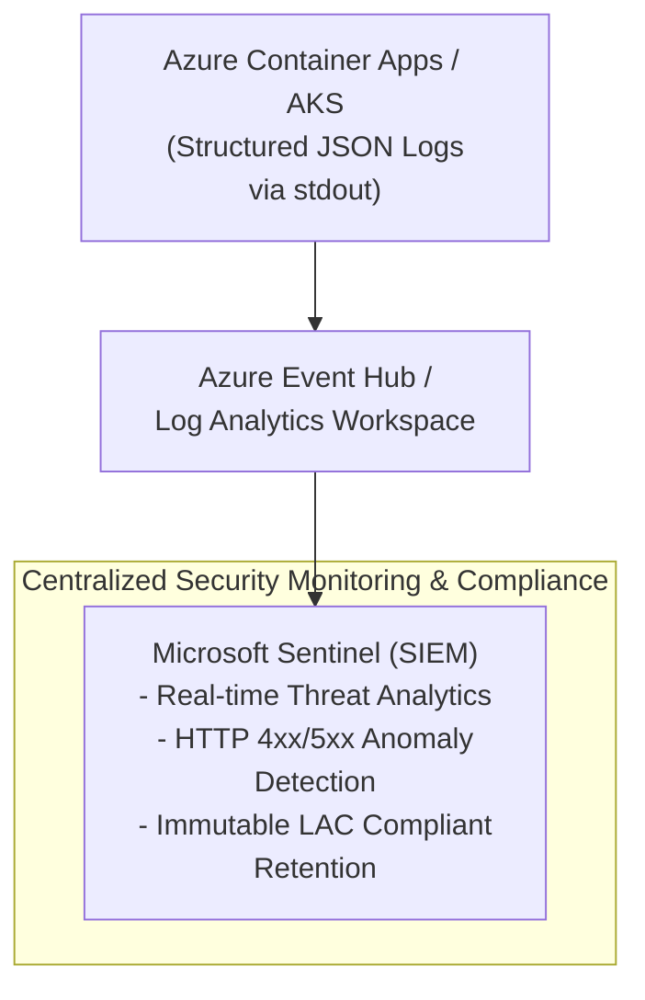

# Security Architecture & Threat Risk Assessment

This document outlines the security controls, prioritized threat mitigation matrix, and enterprise auditing strategy, adhering to **OWASP API Security Top 10** standards and Government of Canada **Protected B** recommendations.

---

## 1. Threat Modeling & Risk Prioritization Matrix

Security risks were evaluated and prioritized based on vulnerability severity, exploitability, and potential impact on parliamentary data integrity:

| Threat Vector | OWASP API Category | Initial Risk | Implemented Mitigation | Residual Risk | Implementation Evidence |
| :--- | :--- | :---: | :--- | :---: | :--- |
| **SQL Injection (SQLi)** | OWASP Top 10: Injection (API10:2023) | **HIGH** | **Strict Parameterization**: Queries use SQLAlchemy 2.0 ORM expressions. Raw SQL concatenation is entirely prohibited. | **LOW** | [`app/main.py:get_department_fte`](../app/main.py) |
| **Projection / Property Injection** | API3:2023 Broken Object Property Level Authorization | **MEDIUM** | **Strict Whitelist Verification**: The `tenure` parameter is checked against a static set (`{"indeterminate", "term", "casual", "student", "missing"}`). Invalid entries immediately abort with HTTP 400. | **LOW** | [`app/main.py:get_department_fte`](../app/main.py) |
| **Container Privilege Escalation** | CWE-250 Unnecessary Privileges | **MEDIUM** | **Non-Root Execution**: Provisions and executes via a locked-down system user (`appuser`, UID 10001). | **LOW** | [`Dockerfile:USER appuser`](../Dockerfile) |
| **Resource Depletion / DoS** | API4:2023 Unrestricted Resource Consumption | **MEDIUM** | **Pydantic Type Boundaries**: Non-integer IDs or queries trigger instant 422 rejections at the gateway layer. Compound indices prevent table-scanning query attacks. | **LOW** | [`app/models.py:idx_dept_year_quarter`](../app/models.py) |
| **Supply Chain Vulnerability (CVE)** | API8:2023 Security Misconfiguration | **MEDIUM** | **Multi-Stage Minimal Runtime**: Build toolchains are discarded. Production runtime is based on stripped `python:3.11-slim`. | **LOW** | [`Dockerfile:FROM python:3.11-slim`](../Dockerfile) |

---

## 2. Implemented Defense-in-Depth

### 2.1 Application-Level Defenses

* **Strict Type Safety**: Query parameters are typed and parsed via Pydantic/FastAPI (`id: int`, `year: Optional[int]`). Any malformed input (e.g., passing string characters into `id`) fails at the gateway layer with HTTP 422 before reaching business logic.
* **Zero Hardcoded Secrets**: No database passwords, private keys, or API tokens are checked into the repository. Configuration parameters are externalized through environment variables.
* **Probes for Cluster Health**: Orchestration platforms (Kubernetes / Azure App Service) can continuously verify process liveness (`/health/live`) and database connectivity readiness (`/health/ready`) to prevent routing traffic to unhealthy instances.

### 2.2 Container & Supply Chain Security

* **Minimal Base Image**: The container utilizes `python:3.11-slim`, significantly reducing the operating system footprint and reducing known CVE surfaces.
* **Deterministic Build Dependencies**: Production dependencies in `requirements.txt` are constrained with minimum version specifications to prevent upstream breaking changes or dependency tampering.
---

## 3. DevSecOps: Automated Supply Chain & Secret Scanning

To guarantee continuous assurance, the CI pipeline is architected to support immediate DevSecOps gate expansions:

* **Immediate CI Enhancement**: Integrating open-source SAST (`bandit -r app/`) and vulnerability auditing (`pip-audit`) can be added directly to `.github/workflows/ci.yml` in under 10 lines of YAML.

## 4. Enterprise Auditing & Centralized Telemetry (Future Cloud Roadmap)

For deployment within federal cloud environments (e.g., Azure Government Canada), runtime auditability and Protected B compliance are satisfied via centralized SIEM integration:

### Key Architectural Controls Recommended:

1. **Secretless Authentication via Managed Identity (MI)**:
   * Eliminates stored connection strings. APIs authenticate directly to Azure PostgreSQL and Key Vault using ephemeral Entra ID (Azure AD) tokens.
2. **Network Isolation (Private Endpoints)**:
   * Databases and backing services are provisioned strictly without public IP addresses, accessible solely via Virtual Network (VNet) private routing.
3. **Structured Audit Logging:**:
   * Incoming requests log client IP hashes, endpoint paths, response codes, and query latencies, streaming directly to Azure Event Hub / Log Analytics for real-time threat detection.